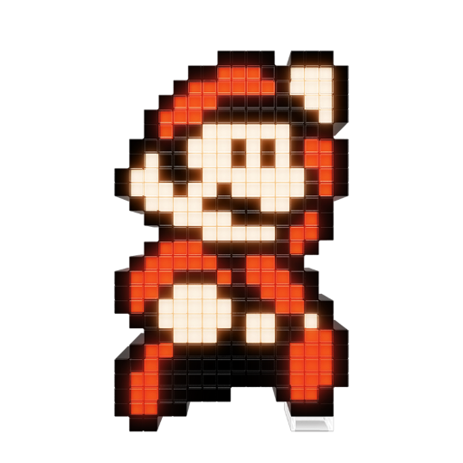
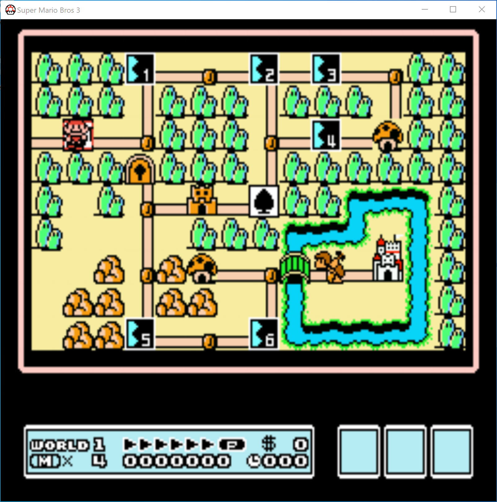
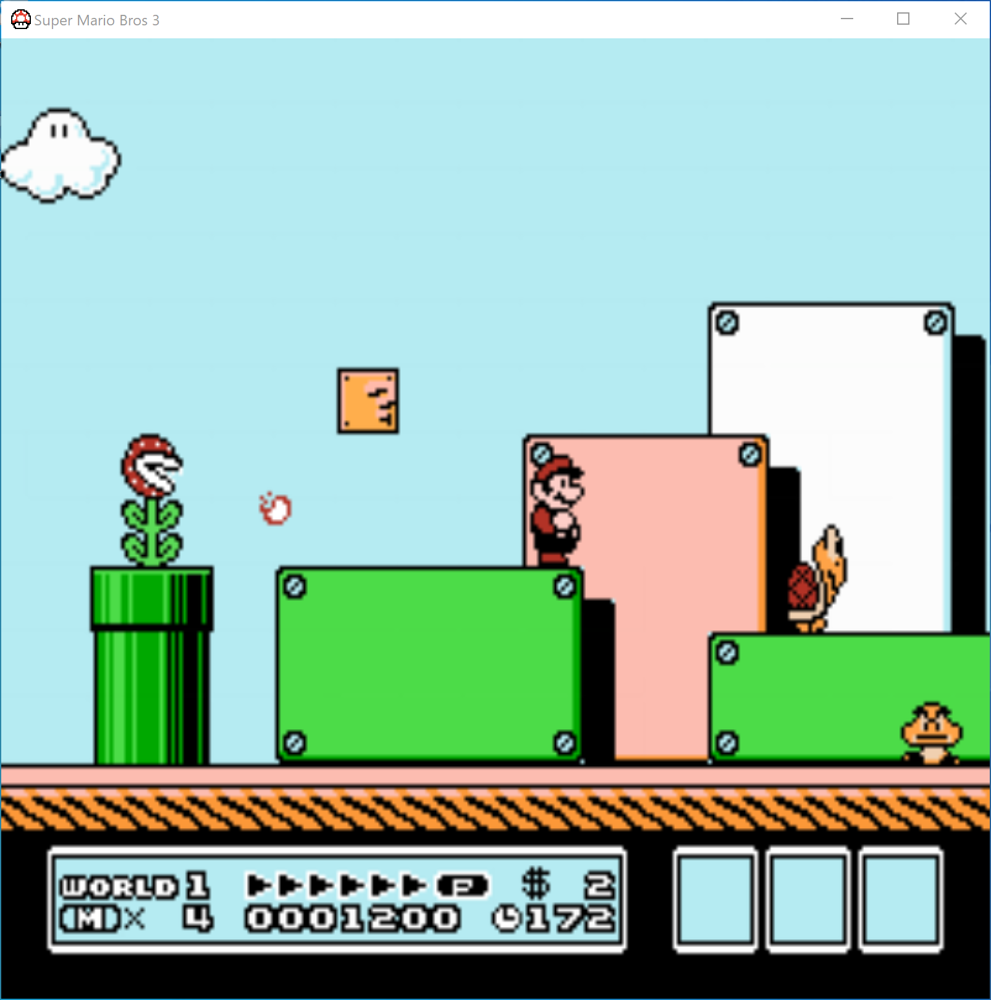
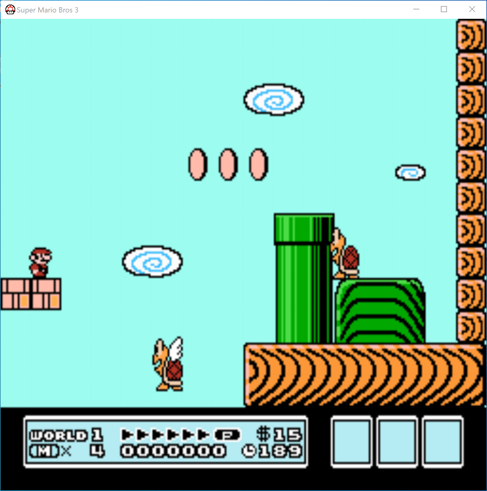

  

<h1 align="center">supermariodx</h1>

A remake of NES Super Mario Bros 3 for Windows using DirectX API

---

## Gameplay

## How to play

- Basic movement:
  <kbd>↑</kbd> <kbd>↓</kbd> <kbd>←</kbd> <kbd>→</kbd>
- Run:
  <kbd>A</kbd>
- Jump:
  <kbd>S</kbd>
- Attack (for Racoon Mario):
  <kbd>Z</kbd>
- Small jump (and slow down descent for Racoon Mario):
  <kbd>X</kbd>
